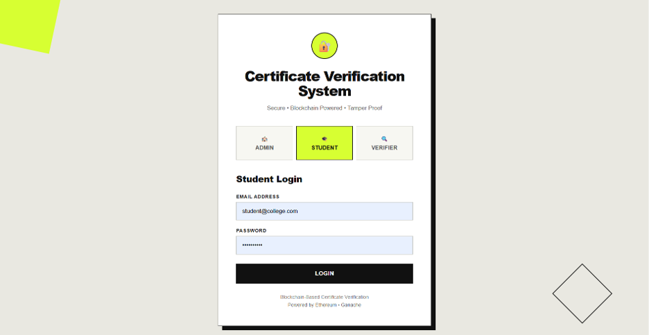
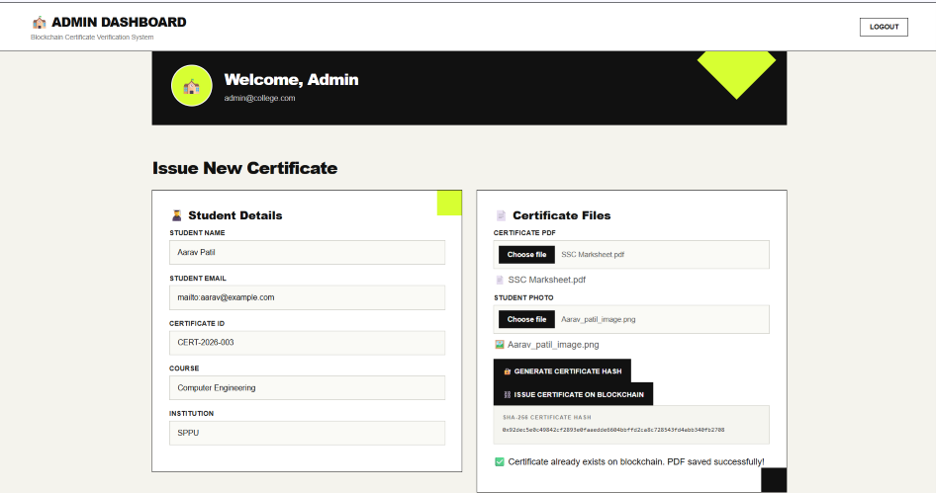
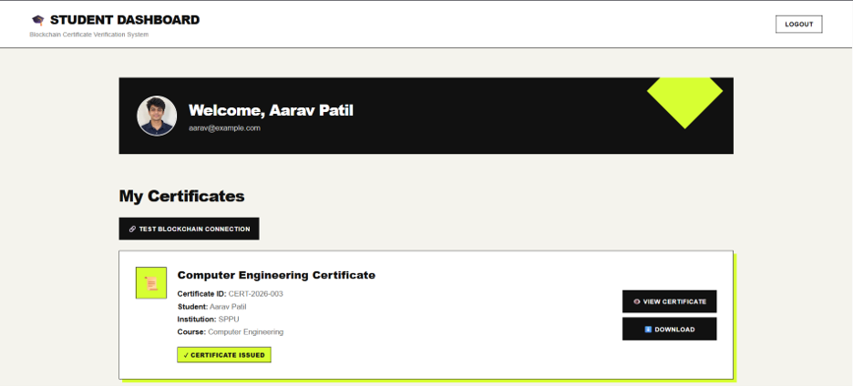
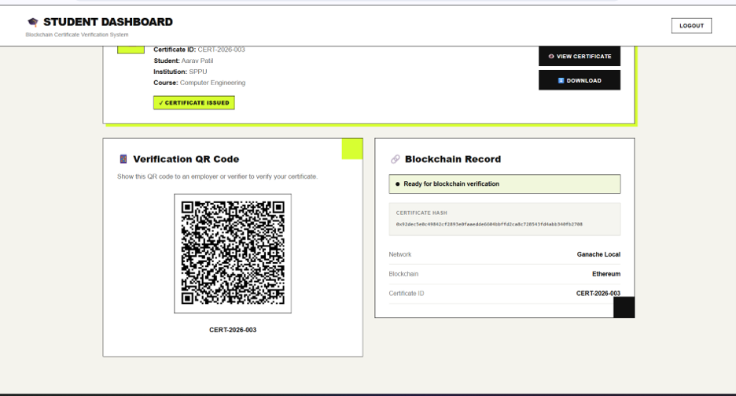
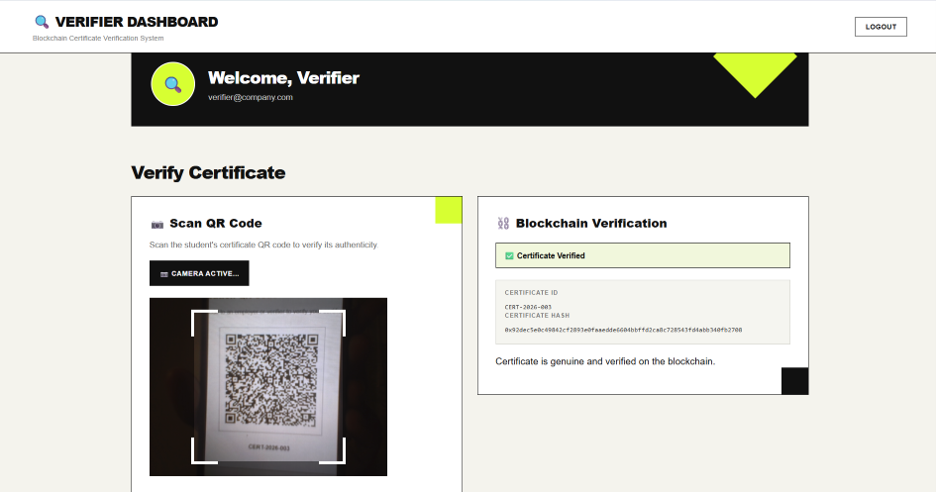
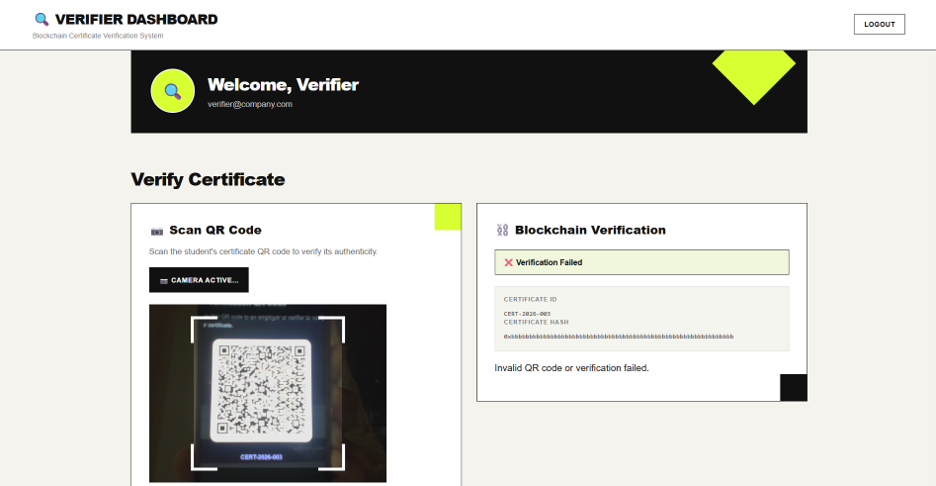

# Blockchain-Based Certificate Verification System

A web-based application for secure academic certificate issuance and verification using blockchain technology.

## Overview

The Blockchain-Based Certificate Verification System provides a digital method for issuing and verifying academic certificates. The system uses a Solidity smart contract deployed on a local Ethereum-compatible blockchain to store certificate information and its cryptographic hash.

The application provides three user roles:

- **Admin** – Issues certificates by entering student details and uploading certificate documents.
- **Student** – Views and downloads the issued certificate and displays a QR code for verification.
- **Verifier** – Scans the student's QR code and verifies the certificate against the blockchain record.

The system uses SHA-256 hashing to generate a unique hash for the certificate PDF. During verification, the hash received through the QR code is compared with the hash stored on the blockchain.

If the hashes match, the certificate is verified as genuine. If they do not match, the system reports that the certificate may be modified or fake.

---

## Key Features

### Admin

- Enter student details
- Enter student email and create student password
- Enter certificate ID
- Upload certificate PDF
- Upload student photograph
- Generate SHA-256 certificate hash
- Issue certificate through a Solidity smart contract
- Store certificate information on the blockchain

### Student

- Login using credentials provided by the Admin
- View personal certificate details
- View student photograph
- View and download certificate PDF
- Display dynamically generated verification QR code
- View blockchain certificate information

### Verifier

- Login as a verifier
- Scan a certificate QR code using the camera
- Read certificate ID and certificate hash
- Compare certificate information with the blockchain
- Display successful verification for genuine certificates
- Detect modified or invalid certificate hashes

---

## System Workflow

```text
                    ADMIN
                      |
                      v
          Enter Student Details
                      |
                      v
             Upload Certificate
                      |
                      v
             Generate SHA-256 Hash
                      |
                      v
          Issue Certificate
                      |
                      v
             Blockchain
        (CertificateRegistry)
                      |
          +-----------+-----------+
          |                       |
          v                       v
       STUDENT                 VERIFIER
          |                       |
          v                       v
   View Certificate          Scan QR Code
          |                       |
          v                       v
     Generate QR          Read Certificate ID
                                +
                           Certificate Hash
                                |
                                v
                         Blockchain Query
                                |
                                v
                       Compare Certificate
                              Hashes
                         /             \
                       Match          Mismatch
                        |                |
                        v                v
                    VERIFIED         FAILED

| Technology | Purpose |
|---|---|
| React.js | Frontend application |
| JavaScript | Application logic |
| Vite | Development and build tool |
| Solidity | Smart contract development |
| Ganache | Local blockchain network |
| Remix IDE | Smart contract compilation and deployment |
| MetaMask | Blockchain wallet and transaction signing |
| ethers.js | Communication between React and blockchain |
| qrcode.react | QR code generation |
| html5-qrcode | QR code scanning |
| SHA-256 | Certificate hashing |
| Node.js | JavaScript runtime |
| npm | Package management |
| VS Code | Development environment |

User Roles
Admin
The Admin is responsible for issuing certificates.
The Admin can:
1. Enter student name and email.
2. Create student login credentials.
3. Enter the certificate ID.
4. Select the course and institution.
5. Upload the certificate PDF.
6. Upload the student's photograph.
7. Generate the SHA-256 certificate hash.
8. Submit the certificate to the blockchain through MetaMask.

Student
The Student can:
1. Login using the credentials provided by the Admin.
2. View personal information.
3. View the issued certificate.
4. Download the certificate PDF.
5. Display the certificate verification QR code.
6. View blockchain certificate information.

Verifier
The Verifier can:
1. Login to the verification dashboard.
2. Scan the student's QR code using the camera.
3. Read the certificate ID and certificate hash.
4. Query the blockchain.
5. Compare the QR code hash with the blockchain hash.
6. Display the verification result.

Smart Contract
The project uses a Solidity smart contract named:
CertificateRegistry

The smart contract provides the following functions:
issueCertificate()
getCertificate()
verifyCertificate()
revokeCertificate()

Each certificate record contains:
- Certificate ID
- Student name
- Course
- Institution
- Certificate hash
- Document hash
- Issuer address
- Issue date
- Validity status
The current prototype uses Ganache as a local blockchain network.
Certificate Hashing
The certificate PDF is processed using the SHA-256 hashing algorithm.
Certificate PDF
      |
      v
   SHA-256
      |
      v
Certificate Hash
      |
      v
Stored on Blockchain

A small change to the certificate PDF results in a different hash.
This allows the system to detect whether the certificate has been modified.
QR Code Verification
The verification QR code is generated dynamically from the issued certificate information.
Example QR data:
{
  "certificateId": "CERT-2026-003",
  "certificateHash": "SHA-256 certificate hash"
}

When the Verifier scans the QR code, the application extracts:
Certificate ID
Certificate Hash

The system then checks the blockchain record.
QR Certificate Hash
        |
        v
Blockchain Certificate Hash
        |
        v
      Compare
      /     \
   Match   Mismatch
     |         |
     v         v
 Verified   Failed

A modified QR code containing an incorrect hash will not match the original blockchain record.
Security Concept
The blockchain acts as a tamper-evident record for certificate information and hashes.
For a genuine certificate:
QR Hash = Blockchain Hash

Result:
Certificate Verified

For a modified certificate:
QR Hash != Blockchain Hash

Result:
Verification Failed

The verification process therefore does not rely only on the QR code. The QR data is checked against the blockchain record.
Project Structure
Blockchain-Certificate-Verification-System/
│
└── frontend/
    │
    ├── public/
    │
    ├── src/
    │   ├── assets/
    │   │
    │   ├── contract/
    │   │   └── contractConfig.js
    │   │
    │   ├── App.jsx
    │   ├── App.css
    │   ├── index.css
    │   └── main.jsx
    │
    ├── .gitignore
    ├── index.html
    ├── package.json
    ├── package-lock.json
    ├── vite.config.js
    └── README.md

Installation and Setup
Prerequisites
Install the following software:
- Node.js
- npm
- Ganache
- MetaMask
- Remix IDE
- VS Code
- Google Chrome or another modern browser
1. Clone the Repository
git clone https://github.com/petal0405/Blockchain-Certificate-Verification-System.git

2. Navigate to the Frontend
cd Blockchain-Certificate-Verification-System/frontend

3. Install Dependencies
npm install

4. Start Ganache
Open Ganache and start the local blockchain workspace.
Use:
RPC URL: http://127.0.0.1:7545
Chain ID: 1337

5. Configure MetaMask
Add the Ganache network to MetaMask:
Network Name:
Ganache - CertificateVerification

RPC URL:
http://127.0.0.1:7545

Chain ID:
1337

Currency Symbol:
ETH

Import a Ganache account into MetaMask for local blockchain transactions.
6. Deploy the Smart Contract
Open CertificateRegistry.sol in Remix IDE.
Compile the contract using a compatible Solidity compiler.
Deploy the contract using the MetaMask account connected to Ganache.
After deployment, update the contract address in:
src/contract/contractConfig.js

7. Start the React Application
npm run dev

Open the application at:
http://localhost:5173

Demo Credentials
Admin
Email: admin@college.com
Password: admin123

Student
Student credentials are created by the Admin while issuing a certificate.
Example:
Email: aarav@example.com
Password: arav123

Verifier
Email: verifier@company.com
Password: verifier123

Testing
Genuine Certificate Verification
1. Login as Admin.
2. Enter student details.
3. Upload the certificate PDF and student photograph.
4. Generate the certificate hash.
5. Issue the certificate on the blockchain.
6. Login as the Student.
7. Display the verification QR code.
8. Login as the Verifier.
9. Scan the QR code.
10. Compare the QR hash with the blockchain record.
Expected result:
Certificate is genuine and verified on the blockchain.

Tampered Certificate Verification
For testing, a QR code can be modified to contain an incorrect certificate hash while keeping the certificate ID unchanged.
Example:
Certificate ID:
CERT-2026-003

Incorrect Hash:
0xbbbbbbbbbbbbbbbbbbbbbbbbbbbbbbbbbbbbbbbbbbbbbbbbbbbbbbbbbbbbbbbb

The blockchain still contains the original certificate hash.
Therefore:
QR Hash != Blockchain Hash

Expected result:
Verification failed.
Certificate may be fake or modified.

## Screenshots

### Login Interface



### Admin Dashboard



### Student Dashboard



### Student Dashboard



### Successful Certificate Verification



### Failed Certificate Verification




Prototype Notes
This project is an academic prototype running on a local Ganache blockchain.
- Ganache is used as the local blockchain network.
- Certificate information and cryptographic hashes are stored on the blockchain.
- The certificate PDF and student photograph are handled locally in the browser for the prototype.
- Authentication is implemented on the frontend for demonstration purposes.
- The current prototype uses browser local storage for the active certificate/student data.
- The current blockchain deployment is local and is not a production blockchain deployment.
- A production implementation would require backend authentication, secure password storage and secure document storage.

Future Enhancements
- Deploy the smart contract to a public blockchain or test network.
- Add backend-based authentication and authorization.
- Support multiple students and institutions.
- Store certificate documents using secure cloud or decentralized storage.
- Add institutional administrator management.
- Add certificate revocation management.
- Improve role-based access control.
- Provide a public certificate verification portal.
- Add blockchain transaction history.
- Integrate a blockchain explorer.
- Improve document storage and privacy.

Project Objective
The main objective of this project is to demonstrate how blockchain technology and cryptographic hashing can be used to develop a tamper-evident academic certificate verification system.
The project integrates:
React.js
    +
Solidity Smart Contract
    +
Ganache Blockchain
    +
MetaMask
    +
ethers.js
    +
SHA-256
    +
QR Code Verification

to provide a simple and reliable certificate issuance and verification workflow.

Author
Petal Swaminathan
Computer Engineering
Savitribai Phule Pune University (SPPU)